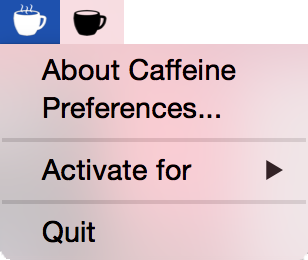

Caffeine
=======================

> [Caffeine](http://lightheadsw.com/caffeine/) is a tiny program that puts an icon in the right side of your menu bar. Click it to prevent your Mac from automatically going to sleep, dimming the screen or starting screen savers. Click it again to go back. Right-click (or ⌘-click) the icon to show the menu.

Slightly tinkered with, this version of Caffeine has been updated to support Retina-display devices, and give it the look it deserves on this year's operating system.

